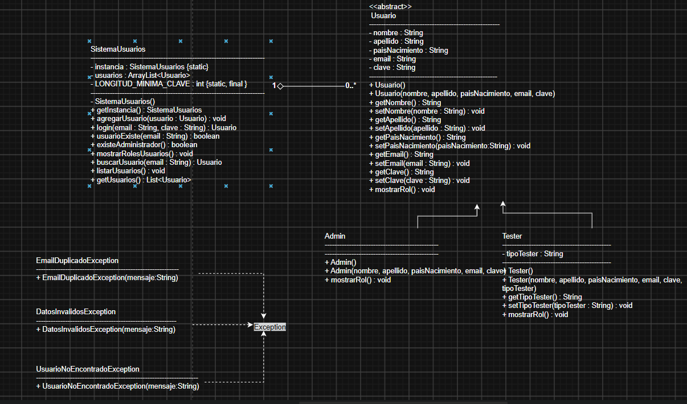

# Sistema de Gestión de Usuarios

## Descripción

El proyecto fue desarrollado en Java aplicando Programación Orientada a Objetos.

El sistema permite administrar usuarios de tipo Administrador y Tester mediante un menú por consola.

## Funcionalidades

- Registro de administradores.
- Inicio de sesión.
- Registro de usuarios Tester (solo por un Administrador).
- Listado de usuarios.
- Búsqueda de usuarios por email.
- Cierre de sesión.
- Validación de datos ingresados.
- Manejo de excepciones personalizadas.

## Tecnologías utilizadas

- Java
- IntelliJ IDEA
- Programación Orientada a Objetos (POO)

## ¿Cómo ejecutar el proyecto?

1. Clonar o descargar el repositorio de Github.
2. Abrir el proyecto en IntelliJ IDEA.
3. Ejecutar la clase `Main.java`.
4. Utilizar el menú que aparece en consola e ir realizando distintas pruebas para corroborar que el proyecto cumple con los requisitos solicitados.

## Usuarios iniciales 
Estos ya se encuentran precargados en el sistema y puede probarse el mismo con la info que detalla a continuación:
O de lo contrario, cargar nuevos usuarios.
### Administrador

- Email: `admin@gmail.com`
- Contraseña: `1234`

### Tester

- Email: `tester@gmail.com`
- Contraseña: `1234`

## Validaciones implementadas

- No permite emails duplicados.
- Los campos obligatorios no pueden quedar vacíos.
- El email debe tener un formato válido.
- La contraseña debe tener una longitud mínima de 4 caracteres.
- El tipo de Tester es obligatorio.
- Solo el usuario admin puede agregar testers.

## Manejo de excepciones

Se implementaron las siguientes excepciones personalizadas:

- EmailDuplicadoException
- DatosInvalidosException
- UsuarioNoEncontradoException

## Mejoras de diseño

Durante el desarrollo se aplicaron los siguientes conceptos:

- Encapsulamiento.
- Herencia.
- Polimorfismo.
- Abstracción.
- Uso de colecciones (`ArrayList`).
- Patrón de diseño Singleton en `SistemaUsuarios`.

## Diagrama UML

El diagrama UML final del proyecto se realizó con la página web diagrams.net y se encuentra a continuación:

          IMAGEN DEL DIAGRAMA DE CLASES UML
------------------------------------------------

